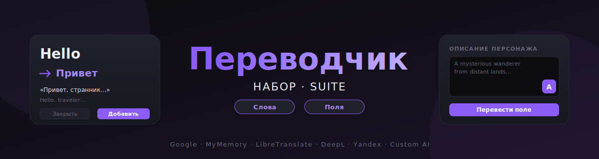

<p align="center">
  
</p>

<h1 align="center">Переводчик: Набор 🌐</h1>

<p align="center">
  <b>Два переводчика в одном расширении для SillyTavern.</b><br>
  Двойной клик по слову в чате — перевод и словарь.<br>
  Кнопка <i class="fa-solid fa-language"></i> в полях карточек — перевод описаний и World Info.<br>
  Единая система кастомизации: цвета, CSS, провайдеры.
</p>

---

## ✨ Возможности

### 📖 Модуль «Слова» — чтение и словарь
- **Двойной клик / двойной тап** по любому слову в сообщении чата → перевод в красивой карточке
- Переводится не только слово, но и **контекст (предложение)**
- **Словарь** — копим все сохранённые слова, поиск, импорт/экспорт CSV
- **Избранное** — сохраняй цитаты: выдели текст и нажми кнопку рядом с курсором
- **Подсветка** сохранённых слов прямо в тексте чата

### ✏ Модуль «Поля» — карточки и лорбуки
- Маленькая кнопка <i class="fa-solid fa-language"></i> в углу каждого поля: описания персонажа, персоны, личности, сценария, примеров, приветствий, World Info и т.п.
- Удобное окно с двумя колонками: **оригинал** и **перевод**
- Перед заменой можно **отредактировать** результат
- **Быстрая смена языков** кнопкой <i class="fa-solid fa-right-left"></i>

### 🎨 Единая кастомизация (работает в обоих модулях)
- **9 цветовых переменных** — акцент, фоны, текст, границы и т.д.
- Поле **Custom CSS** для любых твоих правок
- Каждый модуль можно **включить/выключить** в настройках — используй только то, что нужно

---

## 🔌 Поддерживаемые провайдеры перевода

| Провайдер | Ключ | Примечание |
|-----------|------|-----------|
| **Google Translate** | не нужен | Бесплатно, публичный endpoint |
| **MyMemory** | email (необяз.) | 1000 запросов/день без email |
| **LibreTranslate** | зависит от сервера | Можно self-host |
| **DeepL** | нужен `:fx` ключ | 500 000 симв./мес. бесплатно |
| **Yandex Translate** | IAM / API-Key | 5 млн симв./мес. бесплатно |
| **Custom AI** (OpenAI-совместимый) | нужен | OpenAI, Ollama, прокси и т.п. |

---

## 📦 Установка

1. Распакуй папку `translator-suite` в:
   ```
   SillyTavern/public/scripts/extensions/third-party/translator-suite/
   ```
   (или поставь через **Install extension** по ссылке на репозиторий)
2. Открой SillyTavern → **Extensions** (значок пазла) → **Manage Extensions**
3. Включи «**Переводчик: Набор (слова + поля)**»
4. Обнови страницу

---

## 🚀 Использование

### Модуль «Слова»
1. **Двойной клик** по слову в любом сообщении чата
2. Появится карточка с переводом слова и контекста
3. Кнопка <i class="fa-solid fa-bookmark"></i> **Добавить** — сохранит слово в словарь
4. Кнопка <i class="fa-solid fa-book-open"></i> → открывает словарь (поиск, удаление, экспорт CSV)
5. Включи «Избранное» → выдели фразу в чате → кнопка <i class="fa-solid fa-star"></i> рядом с курсором сохранит её

### Модуль «Поля»
1. Открой карточку персонажа / World Info
2. Наведи курсор на любое поле — в правом нижнем углу появится <i class="fa-solid fa-language"></i>
3. Нажми её — откроется окно **перевода поля**
4. Нажми <i class="fa-solid fa-language"></i> **Перевести**, при желании отредактируй результат
5. <i class="fa-solid fa-check"></i> **Принять и заменить** — текст подставится в поле карточки

### Горячая клавиша
- `Esc` — закрыть любое окно переводчика

---

## ⚙ Настройки

Открываются через шестерёнку <i class="fa-solid fa-gear"></i> в любой карточке. Пять вкладок:

| Вкладка | Что внутри |
|---------|-----------|
| <i class="fa-solid fa-puzzle-piece"></i> **Модули** | Включение/отключение «Слов» и «Полей» |
| <i class="fa-solid fa-language"></i> **Перевод** | Провайдер, ключ, URL, модель, системный промпт, языки |
| <i class="fa-solid fa-book"></i> **Чтение** | Подсветка словаря в чате, включение «Избранного» |
| <i class="fa-solid fa-palette"></i> **Цвета** | 9 цветовых пикеров с текстовыми полями |
| <i class="fa-solid fa-code"></i> **CSS** | Произвольный Custom CSS |

---

## 🎨 Селекторы для Custom CSS

Все элементы расширения имеют префикс `ts-` (**t**ranslator **s**uite). Цвета управляются CSS-переменными:

### Переменные
```css
--ts-accent       /* акцент, стрелки, выделение перевода */
--ts-bg           /* фон оверлея */
--ts-cardBg       /* фон карточки */
--ts-surfaceBg    /* панели и поля ввода */
--ts-text         /* основной текст */
--ts-textMuted    /* второстепенный текст */
--ts-border       /* цвет границы */
--ts-addBtn       /* кнопка «Добавить» / основная */
--ts-closBtn      /* кнопка «Закрыть» / второстепенная */
--ts-radius       /* скругление 18px */
--ts-spring       /* easing для анимаций */
--ts-shadow       /* тень карточки */
```

### Основные селекторы

#### Оверлеи (фон-затемнение с блюром)
```css
#ts-overlay  /* карточка перевода слова */
#ts-vo       /* словарь */
#ts-to       /* избранное */
#ts-so       /* настройки */
#ts-fm       /* окно перевода поля */
```
Класс `.ts-on` добавляется когда окно открыто.

#### Модуль «Слова» — карточка перевода
```css
#ts-card              /* сама карточка */
#ts-top               /* верхняя строка с заголовком */
#ts-title             /* слово-оригинал */
.ts-hbtns             /* группа иконочных кнопок справа */
#ts-trow              /* строка с переводом */
.ts-arr               /* стрелка-иконка */
#ts-tr                /* текст перевода */
#ts-spin              /* спиннер загрузки */
#ts-cru               /* контекст (перевод) */
#ts-cen               /* контекст (оригинал, курсив) */
#ts-btns              /* ряд кнопок внизу */
#ts-bclose            /* кнопка «Закрыть» */
#ts-badd              /* кнопка «Добавить» */
#ts-badd.ts-already   /* когда слово уже в словаре */
#ts-badd.ts-saved     /* после сохранения */
mark.ts-highlight     /* подсветка слов в тексте чата */
```

#### Словарь
```css
#ts-vp                /* панель словаря */
.ts-vhead             /* шапка */
.ts-vhead-title       /* заголовок с иконкой */
.ts-vha               /* группа кнопок справа */
#ts-vsearch           /* строка поиска */
#ts-vq                /* input поиска */
#ts-vcnt              /* счётчик «N слов» */
#ts-vl                /* скролл-контейнер списка */
.ts-ve                /* одна запись */
.ts-vdel              /* кнопка удаления */
.ts-ve-words          /* строка «слово → перевод» */
.ts-vw                /* слово */
.ts-va                /* стрелка */
.ts-vt                /* перевод */
.ts-ve-ctx            /* контекст-перевод */
.ts-ve-orig           /* контекст-оригинал */
.ts-ve-meta           /* мета: чат, дата */
.ts-vempty            /* заглушка «словарь пуст» */
```

#### Избранное
```css
#ts-tp                /* панель избранного */
#ts-tl                /* список цитат */
.ts-te-quote          /* сама цитата */
.ts-qi                /* иконка кавычек */
#ts-fab               /* плавающая кнопка «В избранное» */
#ts-fab-btn           /* собственно кнопка */
```

#### Модуль «Поля» — кнопка и окно перевода
```css
.ts-field-btn         /* маленькая кнопка в углу textarea */
.ts-field-btn.ts-fb-visible  /* состояние «видно» */
#ts-fm-card           /* большое окно перевода поля */
.ts-fm-body           /* тело окна */
.ts-fm-langs          /* ряд выбора языков */
.ts-fm-cols           /* двухколоночный макет */
.ts-fm-col            /* одна колонка (оригинал/перевод) */
.ts-fm-col textarea   /* поле ввода/вывода */
.ts-fm-actions        /* ряд кнопок */
.ts-fm-btn            /* общая кнопка в окне поля */
.ts-fm-primary        /* основная (Перевести) */
.ts-fm-success        /* зелёная (Принять) */
.ts-fm-secondary      /* нейтральная (Отмена) */
.ts-fm-status         /* строка статуса */
.ts-fm-st-ok          /* статус успеха */
.ts-fm-st-err         /* статус ошибки */
.ts-fm-st-info        /* статус информации */
#ts-fm-badge          /* бейдж с названием провайдера */
```

#### Настройки
```css
#ts-sp                /* панель настроек */
#ts-shead             /* шапка */
#ts-stabs             /* ряд вкладок */
.ts-stab              /* одна вкладка */
.ts-stab.ts-son       /* активная вкладка */
.ts-spane             /* содержимое вкладки */
#ts-spane-modules     /* вкладка «Модули» */
#ts-spane-general     /* вкладка «Перевод» */
#ts-spane-reading     /* вкладка «Чтение» */
#ts-spane-colors      /* вкладка «Цвета» */
#ts-spane-css         /* вкладка «CSS» */
#ts-sfooter           /* футер с кнопкой «Сохранить» */
#ts-s-save            /* кнопка «Сохранить» */

.ts-sfield            /* блок «лейбл + поле» */
.ts-pw                /* контейнер пароля с глазом */
.ts-eye               /* кнопка-глаз */
.ts-note              /* подсказка под полем */
.ts-req               /* «обязательно» — оранжевый */

.ts-toggle-row        /* ряд-тоггл */
.ts-toggle-info       /* левая часть */
.ts-toggle-title      /* заголовок тоггла */
.ts-toggle-desc       /* описание */
.ts-switch            /* сам свитч */
.ts-slider            /* «ползунок» */

#ts-cgrid             /* сетка цветовых пикеров */
.ts-cr                /* один блок пикера */
.ts-cr-lbl            /* подпись */
.ts-cpick             /* <input type=color> */
.ts-ctxt              /* текстовое поле hex */
#ts-creset            /* кнопка «Сбросить к умолчанию» */
.ts-cssinfo           /* инфо-блок с кодом */
#ts-s-css             /* textarea Custom CSS */
```

#### Общее
```css
.ts-hb                /* иконочная кнопка в шапках */
.ts-badge             /* маленький бейдж (например «Google Translate») */
#ts-toast             /* всплывающее сообщение */
#ts-toast.ts-toast-show
```

### Пример Custom CSS

```css
/* Синий акцент вместо фиолетового */
:root {
    --ts-accent: #3b82f6;
    --ts-addBtn: #3b82f6;
}

/* Закруглённые карточки побольше */
#ts-card, #ts-vp, #ts-sp, #ts-tp, #ts-fm-card {
    border-radius: 24px;
    border: 1px solid var(--ts-accent);
}

/* Кнопка перевода поля — ярче */
.ts-field-btn {
    opacity: 1 !important;
    box-shadow: 0 4px 16px rgba(139, 92, 246, 0.4);
}
```

---

## 🗂 Структура

```
translator-suite/
  ├── manifest.json   — манифест расширения
  ├── index.js        — вся логика (оба модуля)
  ├── style.css       — стили с CSS-переменными
  ├── banner.svg      — баннер для README
  └── README.md       — этот файл
```

---

## 📜 История

Расширение объединяет и полностью переписывает два ранее отдельных расширения:
- `word-translator` — двойной клик → перевод слова в чате
- `translator-buttons` — кнопка перевода в полях карточек

Теперь это **один пакет** с общей системой настроек, цветов и Custom CSS. Модули можно включать и отключать независимо в настройках — чтобы использовать только «Слова», только «Поля» или оба сразу.

---

<p align="center">
  <i class="fa-solid fa-heart"></i> Сделано с любовью для SillyTavern-сообщества
</p>
